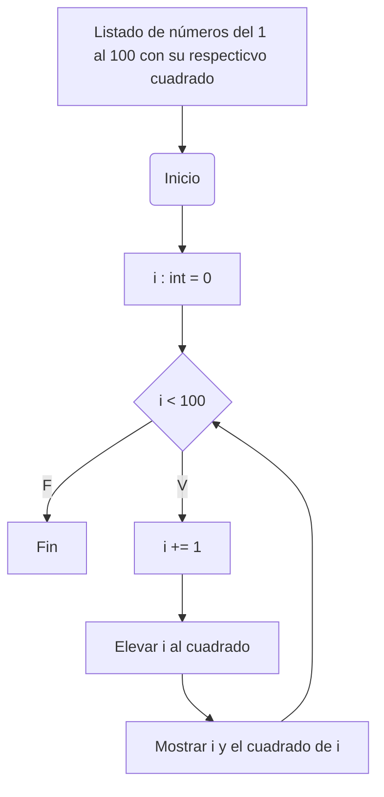

# Ciclo_While_Retico_7
## 1. Imprimir un listado con los números del 1 al 100 cada uno con su respectivo cuadrado.
Aquí declaré la variable, la elevé al cuadrado y utilicé el ciclo while para actualizarla. La verdad es que este punto fue el más sencillo.

## 2. Imprimir un listado con los números impares desde 1 hasta 1000 y seguidamente otro listado con los números pares desde 2 hasta 1000.
Me compliqué mucho en este punto y aunque traté de buscar referencias de mis compañeros, ninguna daba con lo que yo quería mostrar, lo cual era listas separadas; sin embargo, pude desarrollar dos programas, uno que me imprimiera listas de números impares y otro de números pares. Para ambos utilicé el ciclo while con la condición de que fuera i (número impar) o (número par) menor o igual que 1000 en cada caso y, partiendo de la premisa que cada dos unidades hay un número par o impar depende de donde se parta, definí i=1 para que siempre me diera un número impar si le agregaba 2; de igual manera hice con o, más la inicialicé como 2.

## 3. Imprimir los números pares en forma descendente hasta 2 que son menores o iguales a un número natural n ≥ 2 dado
Acá realicé una lista desde m hasta el número que ingresara el usuario, y como me pedían números pares, utilicé el mismo principio que en el punto anterior, es decir, le agrego 2 unidades a m y siempre me dará par, pues m=2; esto, teniendo en cuenta la condición del bucle while, la cual es que m no puede ser mayor que n. Finalmente, ordené la lista de forma descendente (fuera del bucle) con sort pero con reverse = True, lo que permite ordenar la lista de manera descendente.

 

## 4. En 2022 el país A tendrá una población de 25 millones de habitantes y el país B de 18.9 millones. Las tasas de crecimiento anual de la población serán de 2% y 3% respectivamente. Desarrollar un algoritmo para informar en que año la población del país B superará a la de A.
Acá calculé año a año (dentro de while) cuál sería la población de cada país, además, en cada repetición del bucle while, se le agrega 1 al año, lo que permite saber cuánto tiempo le tomará al país b superar la población del país a.

## 5. Imprimir el factorial de un número natural n dado.
Aquí utilicé el ciclo while y dos variables que se relacionan entre sí para allar el factorial. Al principio quise hacer un bucle con n *(n-1), más, después me dí cuenta que era mejor declarar e inicializar 2 variables que me permitieran actualizar a m y que pueda hallarse el factorial partiendo de la premisa de que m siempre va a aumentar en 1 y va a ser multiplicado por el factorial (el cual siempre es actualizado), además de que m nunca va a ser mayor que n.

## 6. Implementar un algoritmo que permita adivinar un número dado de 1 a 100, preguntando en cada caso si el número es mayor, menor o igual.
Este punto me costó mucho, pues, no sabía como plantearlo bien; sin embargo, después pensé que sería mejor hacerlo con una función y poner condiciones dentro de ella. Así, utilicé una función "main" que le pide al usuario escribir el número, sin embargo, el algoritmo no lo sabe (es sólo para que la persona lo tenga en cuenta). El algoritmo empieza preguntandole al usuario si su número es 50, y según su respuesta, va o a sumarle uno más a ese 50 y volverle a preguntar o va a restarle uno y le preguntará otra vez; así hasta que el usuario responda con una s de que sí acertó el algoritmo. Cabe aclarar que el algoritmo no es sensible a letras mayúsculas o minúsculas, pues, con el comando lower, la letra se convierte automáticamente en minúscula para que el algoritmo la pueda interpretar.

## 7. Implementar un programa que ingrese un número de 2 a 50 y muestre sus divisores.
Aquí cree una lista vacía que después se completará en el ciclo while sólo si se cumple que i y las actualizaciones de i al dividirse con el número dado, den como residuo cero.

## 8. Implementar el algoritmo que muestre los números primos del 1 al 100. Nota: use funciones.
Aquí quise implementar el algoritmo que plantee en mi pseudocódigo en el <a href="https://github.com/Cate1911/Retico_3.git">Reto 3</a>, así que seguí los mismos pasos de mi pseudocódigo, sólo que con el ciclo while. Así, me dí cuenta que el ciclo while es una herramienta muy buena para agilizar los procesos en vez de ponerse a copiar una y otra vez el mismo procedimiento.  

¡DESPUÉS DE TANTO, LO HICE! Me siento muy orgullosa y a la vez exhausta, así que si estás leyendo esto, deja una estrellita y estírate VAGO (A) y toma agüita. Pero YAAA!!!

**_NOTA: No sé que le pasó´a Mermaid o Github que el primer código si me permitió dejarlo en diagrama de flujo y los otros no_**
