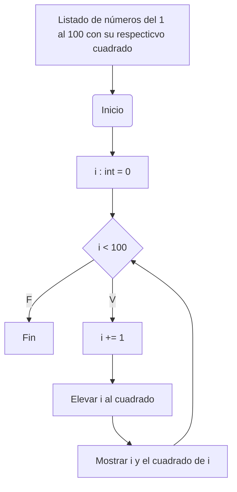

# Ciclo_While_Retico_7
## 1. Imprimir un listado con los números del 1 al 100 cada uno con su respectivo cuadrado.

    

## 2. Imprimir un listado con los números impares desde 1 hasta 999 y seguidamente otro listado con los números pares desde 2 hasta 1000.
## 3. Imprimir los números pares en forma descendente hasta 2 que son menores o iguales a un número natural n ≥ 2 dado
## 4. En 2022 el país A tendrá una población de 25 millones de habitantes y el país B de 18.9 millones. Las tasas de crecimiento anual de la población serán de 2% y 3% respectivamente. Desarrollar un algoritmo para informar en que año la población del país B superará a la de A.
## 5. Imprimir el factorial de un número natural n dado.
## 6. Implementar un algoritmo que permita adivinar un número dado de 1 a 100, preguntando en cada caso si el número es mayor, menor o igual.
## 7. Implementar un programa que ingrese un número de 2 a 50 y muestre sus divisores.
## 8. Implementar el algoritmo que muestre los números primos del 1 al 100. Nota: use funciones.
